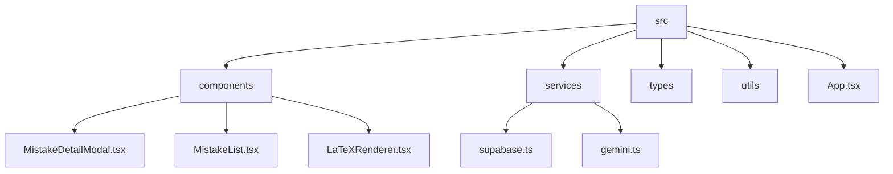

# [System Architecture] 더쿠키수학 오답노트 서비스 설계 지도

이 문서는 AI 에이전트 및 개발자가 더쿠키수학 오답노트 프로젝트의 전체 아키텍처, 의존성 흐름, 데이터베이스 명세, 그리고 AI 진단 파이프라인을 단번에 이해하고 안전하게 개발할 수 있도록 설계된 시스템 지도(System Map)입니다. 

---

## 📂 1. 디렉토리 구조 및 파일별 역할



### 1-1. 핵심 디렉토리 명세
* **`src/`**: React 및 Vite 기반 프로젝트 소스 루트.
  * **`App.tsx`**: 전역 상태(오답 리스트, 로그인 세션, 로딩 상태 등) 관리 및 메인 화면 탭 라우팅을 담당하는 엔트리포인트 컴포넌트.
  * **`components/`**: UI 조각 컴포넌트들.
    * **`MistakeDetailModal.tsx`**: 오답 카드 클릭 시 열리는 핵심 팝업. AI 밤티 처방전 렌더링, 3차 복습 이력 기록, 동적 로딩 인터랙션 탑재.
    * **`MistakeList.tsx`**: 메인 화면의 오답 리스트 보드 및 동료 복습 현황 위젯 렌더링.
    * **`LaTeXRenderer.tsx`**: KaTeX를 이용하여 AI가 출력한 LaTeX 수학 수식을 브라우저에 깨짐 없이 표현해 주는 렌더러.
  * **`services/`**: 외부 인프라스트럭처와의 통신 레이어.
    * **`supabase.ts`**: Supabase DB와 연동하기 위한 클라이언트 초기화 코드.
    * **`gemini.ts`**: 구글 Gemini API 호출, 시스템 프롬프트(밤티 페르소나 및 학년 기호 억제), 2차 챕터 핫픽스 매퍼 함수 탑재.
  * **`types/`**: TypeScript 공통 인터페이스.
    * **`index.ts`**: `MistakeEntry`, `MistakeAnalysis`, `ReviewState`, 교육과정 맵(`MATH_CURRICULUM`) 명세.
  * **`utils/`**: 공통 헬퍼 함수군.
    * **`date.ts`**: 날짜 데이터 포맷 및 랭킹 정렬용 유틸.

---

## 🗄️ 2. 데이터베이스 (Supabase) 스키마

현재 이 에이전트 시스템에 구성 및 로드되어 있는 유일한 외부 개발 도구(MCP)는 **`supabase`**이며, 아래 테이블들을 조회하고 읽을 수 있습니다.

### 2-1. `mistakes` 테이블 (오답 메인 레코드)
| 컬럼명 | 데이터 타입 | 설명 |
| :--- | :--- | :--- |
| `id` | `uuid` (PK) | 오답 카드의 고유 식별자 |
| `user_id` | `uuid` (FK) | `auth.users` 테이블과 연동되는 학생 고유 ID |
| `title` | `text` | AI가 자동으로 적어준 문제 한끝 요약 제목 |
| `image_url` | `text` | Supabase Storage에 업로드된 문제 원본 이미지 주소 |
| `date` | `timestamptz` | 오답 등록 날짜/시간 |
| `reviews` | `text[]` (Array) | 3차 복습 진행도 배열 (예: `['O', 'X', 'star']`) |
| `grade` | `text` | 정규 과목명 (예: `중3-1`, `공통수학1`, `대수` 등) |
| `chapter` | `text` | 정규 소단원명 (예: `이차방정식`, `수열` 등) |
| `root_causes` | `text[]` (Array) | 체크된 실수 원인 태그 리스트 (예: `['calc', 'formula']`) |
| `user_action_plan` | `text` | 학생이 직접 작성한 재발 방지 대책 |
| `analysis` | `jsonb` | AI '밤티'가 분석한 4단계 풀이 보고서 패키지 |

### 2-2. `recent_peer_activities` (뷰 / VIEW)
* **목적**: 동료 학생들의 실시간 학습 자극 피드를 위젯에 뿌려주기 위한 읽기 전용 뷰.
* **필드**: `mistake_id`, `display_name`, `username`, `title`, `reviews`, `updated_at`.

---

## 🤖 3. AI 진단 & 로딩 인터랙티브 파이프라인

수학 진단이 진행될 때의 전체 통신 및 렌더링 시퀀스는 다음과 같습니다.

### 3-1. 통신 및 매핑 흐름
```
[Client] 문제진단 버튼 클릭 
   │
   ▼
[App.tsx] handleStartAnalysis 가동
   │ (Base64 이미지와 학생 학년 전달)
   ▼
[gemini.ts] analyzeProblemImage 실행 (Google AI SDK 호출)
   │ 
   │ ➔ 엔진: 'gemini-2.5-flash' 단독 1회 호출 (가성비 요금 세이브 핫픽스)
   │ ➔ 프롬프트 규칙에 따라 4단계 초슬림 처방전 및 grade/chapter 단독 분류 응답
   ▼
[gemini.ts] normalizeGradeAndChapter 매퍼 보정
   │ (AI가 뱉은 단원명을 MATH_CURRICULUM의 정식 대단원/소단원으로 교차 대조 및 꼬임 복구)
   ▼
[App.tsx] Supabase DB에 최종 데이터 Update
   │
   ▼
[Client] 모달창 로딩 게이지 강제 100% 상승 및 해설 화면 렌더링 스위칭
```

### 3-2. ⏳ 로딩 화면 가상 시뮬레이션 및 롤링 규칙 (3초 주기)
Gemini API는 통짜 JSON이 다 작성되어 들어오기 전까지(평균 8~12초 소요) 중간 진척도를 통신할 수 없습니다. 따라서 클라이언트에서 3초 간격의 가상 시뮬레이션 롤링 타이머를 구동합니다.

* **0초~6초 시점 (정적 3문구 1회 순차 노출)**:
  * 0초: `"밤티가 오답 분석을 시작합니다..."`
  * 3초: `"밤티가 문제 이미지를 열심히 판독하고 있어요... 🔍"`
  * 6초: `"밤티가 수학 수식과 기호들을 꼼꼼하게 정리하고 있어요. ✍️"`
* **9초 이후~ 시점 (동적 메시지 무한 순환)**:
  * AI가 보낸 3개 문구는 다신 반복되지 않으며, 아래의 실시간 정보만 무한 롤링됩니다:
    1. **누적 통계**: 누적 오답 수, 3차 복습 완수(보관함 졸업) 개수 및 완료 비율.
    2. **정답률**: 전체 복습 시도 횟수 대비 동그라미(`'O'`) 성공 비율.
    3. **오늘 하루 수치**: 오늘 날짜로 새로 등록된 오답 카드 개수.
    4. **방치 리마인더**: 1차 복습도 진행하지 않은 가장 오래된 카드의 단원 정보 경고.
    5. **실수 유형 비율**: 5대 실수 태그 중 가장 비율이 높은 취약 유형(예: 계산실수 45%) 분석.
    6. **동료 학습 피드**: 동료 학생의 최근 복습 성공(O) 및 도전(X) 실시간 피드 알림.

---

## ⚠️ 4. 사이드 이펙트 방지를 위한 필수 규칙 (Rules)

개발 에이전트와 기여자는 다음 규칙을 절대적으로 준수해야 합니다.

1. **AI 밤티 페르소나의 일관성**:
   * 밤티는 실제 교사(더쿠키수학 쌤 등)가 아니며, 선생님을 성실히 보좌하는 **"AI 수학 클리닉 비서 캐릭터"**입니다.
   * 학생에게 무리하게 반말을 하거나 인격적 주체인 척 쌤이라고 지칭하지 말고, 정중하고 다정한 해요체 존댓말로 작성해야 합니다.
2. **학생 학년에 맞는 기호 억제 (Curriculum Locking)**:
   * **학생 학년이 중3인 경우**: 풀이 및 힌트에 시그마($\sum$), 로그($\log$), 극한($\lim$), 미적분 기호($\int$)를 절대 사용하지 마십시오. 합은 $a_1 + a_2 + a_3 + \dots$ 처럼 직관적으로 풀어 써야 합니다.
   * **학생 학년이 고1인 경우**: 고2 이상 기호인 시그마, 극한, 미적분 기호를 풀이에서 완전히 억제하십시오.
3. **단원 분류 묶기 전면 금지**:
   * AI가 단원(chapter)을 내뱉을 때 `이차방정식과 이차함수` 처럼 복수의 단원을 결합해 묶어 분류하는 것을 금지합니다.
   * 그래프 기하 위주면 **`이차함수`**, 등식의 근 구하기/판별식이면 **`이차방정식`**으로 단독 분류해야 합니다.
4. **버전 관리 수칙 (AGENTS.md 규칙)**:
   * 자잘한 레이아웃 보정, 단순 문구 수정 등 마이크로 개정은 `package.json` 버전을 올리지 마십시오.
   * 완성된 기능 개선 사항이 **3~4개 이상 축적**되어 실서버 테스트가 완벽히 검증되었을 때만 통합으로 버전을 한 단계 판올림 합니다.
